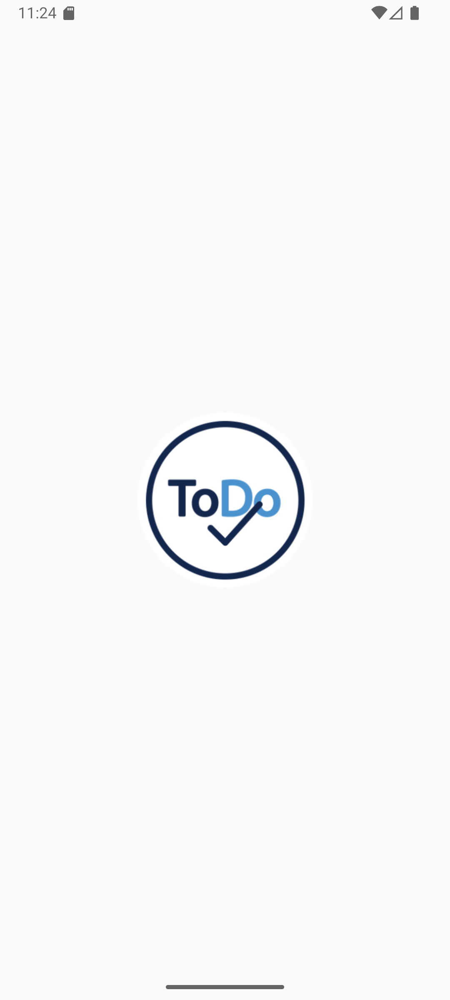
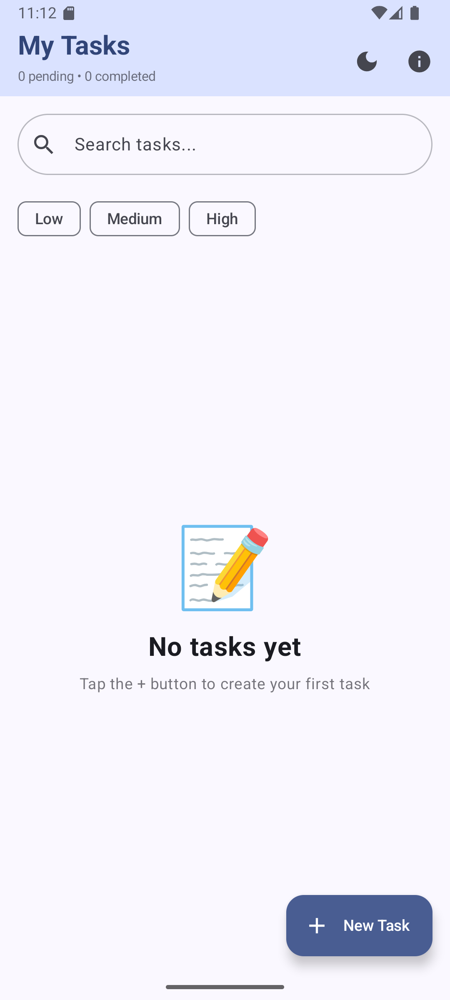

# 📋 ToDo App – Android (Learning Project)

This is a **simple Android ToDo application** created as a **learning project** to understand how Android app development works using **Android Studio** and **Kotlin**.

The main goal of this project was **not** to build a production-ready app, but to explore:
- Android Studio workflow
- APK generation and installation on a real Android phone
- Local data storage
- SMS sending functionality
- How AI tools can assist in mobile app development

---

## 🎯 Project Purpose

This project was built to learn and experiment with:

- How Android Studio projects are structured
- How to build, run, and install APKs on Android devices
- How SMS sending works in Android
- How local databases (Room) work
- How AI tools like ChatGPT can assist in learning and development

---

## ✨ Features

- Add and delete simple tasks
- Store tasks locally using Room Database
- Basic task attributes (title, description, optional phone number)
- Send task details via SMS
- Light and Dark mode support
- Simple and clean UI

> ⚠️ This app is intentionally kept **simple** and does not aim to be a full-featured production app.

---

## 🛠️ Tech Stack

- **Language**: Kotlin
- **IDE**: Android Studio
- **UI**: Android UI Toolkit / Jetpack components
- **Database**: Room (SQLite)
- **Architecture**: Basic MVVM concepts
- **Build System**: Gradle (Kotlin DSL)

---

## 🤖 AI Tools Used

This project was developed with significant assistance from AI tools:

- **ChatGPT (OpenAI)** – Used for explanations, code guidance, and learning support
- **Google Antigravity** – AI-powered integrated development environment

---

## 🚀 Getting Started

1. Clone the repository:
   ```bash
   git clone https://github.com/USER/ToDoApp.git
   ```
2. Open the project in **Android Studio**.
3. Let **Gradle** sync.
4. Run the app on an emulator or physical Android device.

---

## 📱 APK & Testing

- APKs were generated using **Android Studio**.
- The app was tested on a real Android phone.
- SMS functionality was tested using a physical SIM card.

---

## 📌 Notes

- This project is intended only for learning purposes.
- Code quality and structure reflect a beginner-level Android project.
- Future improvements may be added as learning continues.

---




---

## (-_-) Author

Akalanka Senanayake

---

## 📜 License

This project is open-source and free to use for learning and educational purposes.